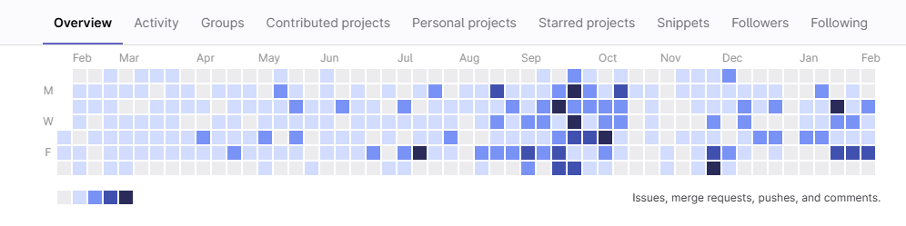

# Hi, I'm Thiago Messias! 👋

I'm a **Senior Full Stack Developer** with a strong focus on TypeScript.

---

## Technologies

  
  
  
  
  
  
  

---

## My Work

### 2024 ~ Current

  

Working in front-end development of a robust invoicing system designed to minimize claim rejections ("glosas") by incorporating intelligent validation rules that prevent common user errors. The system is engineered to process invoices—not payments—which are subsequently settled by the state. This approach ensures that over 100 public hospitals in Brazil strictly adhere to government billing regulations, thereby reducing inaccuracies in procedure invoicing and maintaining regulatory compliance while handling billions of reais in invoiced amounts.

**Role:** Senior Frontend Developer  
**Technologies:** React, TypeScript

### 2021 ~ 2024

**Car Reservation Platform:**  
We developed a comprehensive car reservation system that handles the entire booking lifecycle—from making reservations to processing payments. This robust platform is designed to manage high traffic volumes securely and efficiently, directly contributing to generating millions of reais in monthly revenue.

**Resort Sales and Marketing:**  
Our role was to design and develop high-conversion landing pages and websites for luxury resorts. Our targeted digital campaigns have proven extremely successful; on Black Friday in 2023, our campaign generated 100 million reais in just two hours, and in 2024 that figure increased to 140 million reais. Additionally, we run continuous, targeted campaigns throughout the year, significantly boosting the client's online engagement and driving bookings.

**Role:** Senior Full Stack Developer & Team Leader (Team of 5 Developers)  
**Technologies:** React, TypeScript, Next.js

---

## Personal Projects

I've also developed a VSCode extension: [VSCode Prompt Master](https://github.com/Thiiaguinho/vscode-prompt-master) to help developers.
